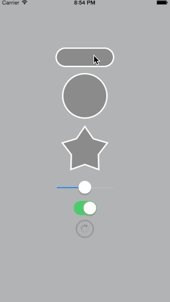

# Pulsar

**Pulsar** is a versatile solution for **displaying pulse animations** as known from **Apple Maps**.

Being implemented on **CALayer**, **Pulsar** is compatible with **just about any UI control** thinkable, given that every **UIView** is backed by a **CALayer**.

## Preview


## Features

**Pulsar** consists of a **simple category** on **CALayer** making use of the **builder pattern** for **hassle-free customization**:

- Custom **duration** and **repeat count**.
- Custom **line width**.
- Custom **background** and/or **border colors**. (optional)
- Custom **path**. (optional)
- **Start/stop blocks** for attaching a **callback**. (optional)

While **all** these attributes **can be set**, **none** of them **have to be set explicitly**.

**Pulsar** will try to **figure out the most likely default colors and paths on its own** (inferred from the host layer's properties, such as its border color), unless one supplies it with custom properties via its builder.

For more info take a look at these methods:

```swift
    class func defaultBackgroundColorsForLayer(layer: CALayer) -> [CGColor]
    class func defaultBorderColorsForLayer(layer: CALayer) -> [CGColor]
    class func defaultPathForLayer(layer: CALayer) -> CGPathRef
```

## Usage

To add a (one-time) pulse using **smart default properties** to a layer (e.g., the layer of a **UIView**) simply call `addPulse()` on it:

```swift
layer.addPulse()
```

Or if you want to set a custom appearance:

```swift
layer.addPulse { builder in
	builder.borderColors = [UIColor.redColor().CGColor]
	builder.backgroundColors = []
}
```

To have a pulse repeat a given number of times set a `repeatCount` on the `builder`:

```swift
builder.repeatCount = 42 // or Int.max for infinity
```

## Installation

Just copy the files in `"Pulsar/Classes/..."` into your project.

Alternatively you can install **Pulsar** into your project with [CocoaPods](http://cocoapods.org/).
Just add it to your Podfile: `pod 'Pulsar'`

## Demos

**Pulsar** contains a demo app giving you a quick overview of some of the possible use cases.

## Swift

**Pulsar** is implemented in **Swift 3**.

## Dependencies

None.

## Creator

Vincent Esche ([@regexident](http://twitter.com/regexident))

## License

**Pulsar** is available under a **modified BSD-3 clause license** with the **additional requirement of attribution**. See the `LICENSE` file for more info.
